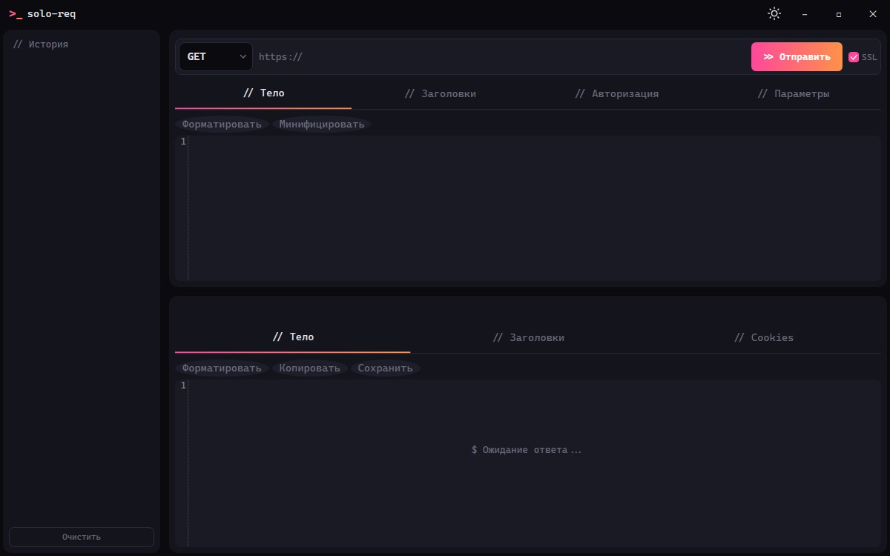
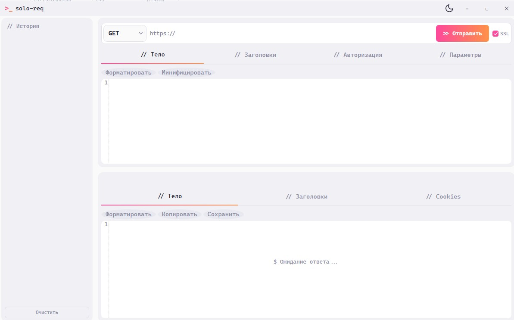

# >_ solo-req

Компактный десктопный HTTP-клиент для тестирования REST API. Аналог Postman и Insomnia, только без облака, без аккаунтов и без подписок — просто `.exe`, который работает локально. Терминальная эстетика, минимум интерфейса, максимум дела.

## Зачем ещё один HTTP-клиент

Проект делался для себя. В какой-то момент решил довести до состояния, которое не стыдно показать людям.

Популярные решения давно переросли задачу «отправить запрос и посмотреть ответ». Postman требует регистрации и тянет данные в облако. Insomnia пошла тем же путём. Долго пользовался Thunder Client прямо в VS Code — удобно, пока не ввели платную подписку и бесплатных возможностей перестало хватать.

solo-req — результат: минимальный десктопный инструмент, который делает ровно то, что нужно. Никаких аккаунтов, никакого облака, никаких подписок. Запустил, отправил запрос, получил ответ.

## Скриншоты

| Тёмная тема | Светлая тема |
|---|---|
|  |  |

## Что умеет

- 7 HTTP-методов: GET, POST, PUT, PATCH, DELETE, HEAD, OPTIONS
- Подсветка синтаксиса JSON, XML и HTML — на базе AvalonEdit с палитрой Material Theme Palenight
- 5 типов авторизации: None, Basic, Bearer, API Key, Custom Header
- Менеджер cookies с автоотправкой
- История запросов с возможностью повтора
- SSL-переключатель — схема http/https привязана к нему
- Форматирование и минификация JSON
- Две темы (тёмная и светлая) с переключением по F12
- Горячие клавиши для всех основных действий

## Горячие клавиши

| Комбинация | Действие |
|---|---|
| `Ctrl+Enter` | Отправить запрос |
| `Ctrl+Shift+F` | Форматировать JSON |
| `Ctrl+L` | Фокус на URL |
| `Ctrl+K` | Менеджер Cookies |
| `Ctrl+H` | Фокус на историю |
| `Ctrl+D` | Очистить запрос |
| `F12` | Переключить тему |
| `F1` | О программе |

## Сборка и запуск

Нужен [.NET 8 SDK](https://dotnet.microsoft.com/download/dotnet/8.0).

**Сборка:**

```bash
dotnet build SoloReq/SoloReq.sln
```

**Запуск:**

```bash
dotnet run --project SoloReq/SoloReq
```

**Публикация в один exe (self-contained, ~150 МБ):**

```bash
dotnet publish SoloReq/SoloReq/SoloReq.csproj -c Release -r win-x64 --self-contained -p:PublishSingleFile=true -o SoloReq/publish --source https://api.nuget.org/v3/index.json
```

На выходе — один `SoloReq.exe`, который работает без установленного .NET.

**Публикация framework-dependent (лёгкий вариант, ~5 МБ):**

```bash
dotnet publish SoloReq/SoloReq/SoloReq.csproj -c Release -r win-x64 -p:PublishSingleFile=true -o SoloReq/publish --source https://api.nuget.org/v3/index.json
```

Требует .NET 8 Runtime на машине, зато весит в разы меньше.

NuGet-источник `--source https://api.nuget.org/v3/index.json` указывается явно — без него пакеты могут не разрешиться.

## Стек

- **C# / .NET 8 / WPF** — десктопное приложение под Windows
- **MVVM** — через CommunityToolkit.Mvvm
- **AvalonEdit** — редактор кода с подсветкой синтаксиса
- **Newtonsoft.Json** — парсинг и форматирование JSON
- **Шрифты:** JetBrains Mono (код, URL, статусы) + Inter (подписи, UI)

## Лицензия

Проект распространяется под лицензией [CC BY-NC 4.0](LICENSE). Можно свободно использовать, изучать и модифицировать в некоммерческих целях. Коммерческое использование — только с разрешения автора.

## Автор

Проект разработан в рамках блога [solo-log.ru](https://solo-log.ru).
